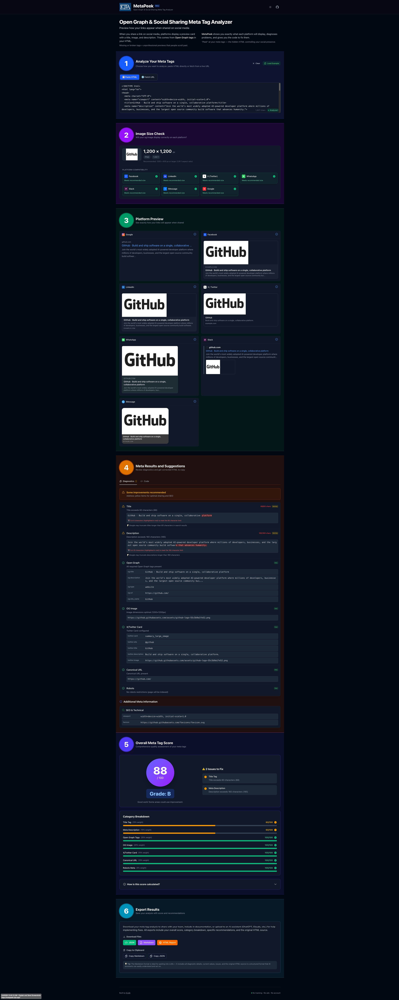

# MetaPeek

> Preview how your website appears when shared on social media — and fix any problems.

[](https://app.netlify.com/projects/clinquant-lily-1beabe/deploys)
[](https://github.com/ICJIA/icjia-metapeek)
[](https://nuxt.com/)
[](https://ui.nuxt.com/)
[](https://vuejs.org/)
[](https://www.typescriptlang.org/)
[](https://www.w3.org/WAI/WCAG21/quickref/)


---

## The Problem

When someone shares a link to your website on Facebook, LinkedIn, X (Twitter), or Slack, those platforms display a **preview card** with a title, description, and image. This information comes from special HTML tags on your page called **Open Graph meta tags**.

If these tags are missing or misconfigured, your shared links may show:

- The wrong title or description
- No image (or the wrong image)
- A generic, unprofessional appearance

This makes your content look unpolished and causes people to scroll past your links.

### Why existing tools fall short

You might think "I'll just use Facebook's Sharing Debugger" — but existing tools have significant limitations:

- **Platform-specific** — Facebook Debugger only shows Facebook previews. X/Twitter Card Validator only shows X. You need to check multiple tools to see the full picture.
- **Account required** — Most debuggers require you to log in, creating friction and privacy concerns.
- **Rate limited** — Free tiers restrict how many URLs you can check, or paywall you after a few uses.
- **Preview-only** — They show you what's wrong but don't give you the code to fix it.
- **Online-only** — They require fetching your live URL, which doesn't help when you're still developing locally or want to check changes before deploying.
- **Ad-heavy** — Third-party tools are often cluttered with ads and upsells.

---

## What MetaPeek Does

MetaPeek helps you **find and fix these issues** before they hurt your reach:

1. **Preview** — See exactly how your page will appear on 7 major platforms — all at once
2. **Diagnose** — Get a color-coded report of missing, incorrect, or suboptimal tags
3. **Fix** — Copy ready-to-use HTML code to give to your developer
4. **Fetch** — Enter any URL to analyze live websites, or paste HTML for offline analysis

| Feature                    | MetaPeek             | Facebook Debugger | X/Twitter Validator |
| -------------------------- | -------------------- | ----------------- | ------------------- |
| Multi-platform preview     | ✅ All 7 platforms   | ❌ Facebook only  | ❌ X only           |
| Live URL fetching          | ✅ Yes               | ✅ Yes            | ✅ Yes              |
| Image dimension analysis   | ✅ All 7 platforms   | ✅ Yes            | ❌ No               |
| Actionable code fixes      | ✅ Copy-paste ready  | ❌ Preview only   | ❌ Preview only     |
| No account required        | ✅ Yes               | ❌ Requires login | ❌ Requires login   |
| No rate limits             | ✅ Generous (10/min) | ⚠️ Limited        | ⚠️ Limited          |
| Works offline (paste mode) | ✅ Yes               | ❌ No             | ❌ No               |
| Ad-free                    | ✅ Yes               | ⚠️ Meta ecosystem | ⚠️ X ecosystem      |

### Platform Previews

MetaPeek shows how your link will appear across **7 major platforms simultaneously:**

**Social Media:**

- 📘 **Facebook** — Feed posts with 1.91:1 images
- 💼 **LinkedIn** — Professional network shares
- 🐦 **X (Twitter)** — Summary cards with large images

**Messaging:**

- 📱 **WhatsApp** — World's most popular messaging app
- 💬 **Slack** — Business communication link unfurls
- 💭 **iMessage** — Apple ecosystem previews

**Search:**

- 🔍 **Google** — Search results and Discover cards

Each preview component accurately mimics the platform's actual appearance, helping you **fix issues before sharing**.

### Why "MetaPeek"?

You're _peeking_ at your _meta_ tags — the hidden HTML that controls how your content appears when shared across the web.

### Who Uses MetaPeek?

**Content creators and marketers** who share articles, blog posts, or campaigns on social media and want their links to look professional and clickable.

**Web developers** who need to verify Open Graph and Twitter Card implementation before deploying, or diagnose why a client's shared links look broken.

**Communications teams** at organizations, agencies, and nonprofits who manage websites but may not have deep technical expertise — MetaPeek explains what's wrong and provides copy-paste fixes.

**SEO specialists** optimizing how pages appear in search results and social shares, checking title/description lengths and image requirements.

**Anyone launching a website** who wants to make a good first impression when their site gets shared.

### Why Is This Important?

Social sharing is often the **first impression** people have of your content. A broken or missing preview card can mean:

- **Lower click-through rates** — People scroll past links that look unprofessional or spammy
- **Lost traffic** — Your carefully crafted content never gets seen
- **Brand damage** — A missing image or wrong title reflects poorly on your organization
- **Wasted promotion** — Paid social campaigns underperform when previews look broken

Studies show that posts with proper Open Graph images get **2-3x more engagement** than those without. MetaPeek helps you capture that opportunity by making it easy to find and fix issues before you hit "share."

---

## Screenshot



---

## Features

### Phase 1 — Client-Side MVP ✅ Complete

- ✅ Paste HTML and parse instantly (< 100ms)
- ✅ Extract all meta tags, Open Graph, X/Twitter Cards, JSON-LD
- ✅ Render accurate platform previews (5 platforms)
- ✅ Diagnostics panel with color-coded status
- ✅ Code generator with editable output
- ✅ WCAG 2.1 AA compliant from day one

### Phase 2 — Live URL Fetching & Platform Expansion ✅ Complete

**URL Fetching:**

- ✅ Enter URL and fetch HTML automatically
- ✅ Netlify serverless function proxy with Nitro
- ✅ SSRF protection and DNS validation
- ✅ Rate limiting (10 requests/IP/minute)
- ✅ Redirect chain tracking (up to 5 redirects)
- ✅ Shareable URLs (manual fetch, no auto-trigger)
- ✅ Progressive status feedback (neutral → amber → red)
- ✅ User-friendly error messages with suggestions

**Platform Previews (7 Total):**

- ✅ Google Search Results
- ✅ Facebook Feed
- ✅ LinkedIn Posts
- ✅ X (Twitter) Cards
- ✅ WhatsApp Messages (NEW)
- ✅ Slack Unfurls
- ✅ iMessage (NEW)

**Image Analysis:**

- ✅ Cross-platform compatibility check (all 7 platforms)
- ✅ Dimension requirements per platform
- ✅ Visual status indicators (optimal/acceptable/fail)
- ✅ Integrated into scoring system (impacts overall score)

**Quality Scoring System (NEW):**

- ✅ Overall meta tag score (0-100 with letter grades A-F)
- ✅ Weighted category scoring (7 categories with custom weights)
- ✅ Brutal honesty: missing tags = 0 points, issues = 60 points, perfect = 100 points
- ✅ Image dimension validation integrated into scoring
- ✅ Trailing slash consistency validation (canonical vs og:url)
- ✅ Detailed category breakdown with progress bars
- ✅ Specific action items for each issue
- ✅ Educational explanations (Lighthouse-style scoring methodology)
- ✅ Scores included in all export formats

**What Makes Phase 2 Special:**

1. **Quality Scoring System** — Get an overall meta tag quality score (0-100) with letter grades (A-F). Uses weighted categories (Open Graph 25%, OG Image 20%, etc.) with brutal honesty: missing tags = 0 points. Image dimensions are validated and integrated into scoring. Includes Lighthouse-style methodology explanations and specific action items.

2. **Security-First** — Enterprise-grade SSRF protection prevents abuse while maintaining usability. DNS validation, private IP blocking, and rate limiting at the edge.

3. **No Account Required** — Unlike platform-specific debuggers (Facebook, Twitter), MetaPeek works without login. Enter any URL and analyze instantly.

4. **Dual Mode** — Switch between URL fetching and HTML pasting. Great for testing before deployment or analyzing sites behind authentication.

5. **Progressive Feedback** — Real-time status updates during fetch with color-coded urgency (neutral → amber → red as time elapses).

6. **Trailing Slash Validation** — Catches SEO-harming inconsistencies between canonical and og:url (e.g., `/page` vs `/page/`). Includes educational explanations about why this matters for search engine ranking.

### Phase 3 — Polish & Power Features 📋

- ✅ Export as JSON/Markdown/HTML with complete analysis and scores
- [ ] OG image analysis with crop overlays
- [ ] Structured data viewer with schema.org validation
- [ ] Diff/compare mode (before/after verification)
- [ ] Raw HTML debug view

---

## Tech Stack

### Core Framework

- **[Nuxt 4](https://nuxt.com/)** (v4.3.0) — Full-stack Vue framework with SSR
- **[Vue 3](https://vuejs.org/)** (v3.5.27) — Progressive JavaScript framework
- **[TypeScript](https://www.typescriptlang.org/)** (v5.7) — Type safety throughout
- **[VueUse](https://vueuse.org/)** (v14.2) — Essential Vue Composition Utilities

### UI & Components

- **[Nuxt UI](https://ui.nuxt.com/)** (v4.4.0) — Fully styled component library
- **[Tailwind CSS 4](https://tailwindcss.com/)** — Utility-first CSS (via Nuxt UI)
- **[Heroicons](https://heroicons.com/)** — Beautiful hand-crafted SVG icons

### SEO & Meta

- **[@nuxtjs/seo](https://nuxtseo.com/)** (v3.4.0) — Technical SEO: sitemap, robots.txt, schema.org, Open Graph meta tags
- **Static OG image** — `public/og-image-v2.png` (1200×630) for social sharing previews

### Server & Deployment

- **[Nitro](https://nitro.unjs.io/)** — Nuxt's server engine for API routes
- **[Netlify](https://www.netlify.com/)** — Serverless functions + edge deployment
- **[ofetch](https://github.com/unjs/ofetch)** — HTTP client for proxy requests

### Parsing & Data

- **[DOMParser](https://developer.mozilla.org/en-US/docs/Web/API/DOMParser)** (native) — Client-side HTML parsing
- **Regex extraction** — Server-side head/body extraction in `server/utils/proxy.ts` (no DOM parser)

### Testing & Quality

- **[Vitest](https://vitest.dev/)** — Modern, fast unit testing
- **[Playwright](https://playwright.dev/)** — E2E and accessibility testing
- **[@axe-core/playwright](https://www.npmjs.com/package/@axe-core/playwright)** — Automated accessibility audits
- **[ESLint](https://eslint.org/)** — Code linting with [@nuxt/eslint](https://eslint.nuxt.com/) module

### Accessibility

- **WCAG 2.1 Level AA** compliance mandatory
- Keyboard navigation for all interactions
- Screen reader tested (NVDA, JAWS, VoiceOver)
- 4.5:1 minimum contrast ratio
- No color-only status indicators

### Custom Components

#### AppTooltip

A custom, accessible tooltip component built from scratch (no external dependencies):

```vue
<AppTooltip text="Helpful information">
  <button>Hover me</button>
</AppTooltip>
```

**Features:**

- **Teleport to body** — Escapes parent `overflow: hidden` containers
- **Fixed positioning** — Calculates position based on viewport space
- **Auto-positioning** — Prefers left/right on desktop, top/bottom on mobile
- **Keyboard accessible** — Shows on focus (Tab key)
- **Screen reader compatible** — Uses `role="tooltip"` and `aria-describedby`
- **Instant display** — No delay (configurable via `delay` prop)
- **Smooth animations** — Fade/scale transitions

**Props:**
| Prop | Type | Default | Description |
|------|------|---------|-------------|
| `text` | `string` | required | Tooltip content |
| `position` | `'auto' \| 'top' \| 'bottom' \| 'left' \| 'right'` | `'auto'` | Preferred position |
| `delay` | `number` | `0` | Delay before showing (ms) |

---

## Project Structure

```
icjia-metapeek/
├── app/
│   ├── assets/
│   │   └── css/
│   │       └── main.css     # Tailwind CSS entry point
│   ├── components/          # Vue components
│   │   ├── AppTooltip.vue       # Custom accessible tooltip
│   │   ├── ImageAnalysis.vue    # Image size compatibility checker
│   │   ├── PreviewGoogle.vue
│   │   ├── PreviewFacebook.vue
│   │   ├── PreviewLinkedIn.vue
│   │   ├── PreviewTwitter.vue
│   │   ├── PreviewWhatsApp.vue  # Phase 2
│   │   ├── PreviewSlack.vue
│   │   ├── PreviewiMessage.vue  # Phase 2
│   │   ├── DiagnosticsPanel.vue
│   │   └── CodeGenerator.vue
│   ├── composables/         # Reusable composition functions
│   │   ├── useMetaParser.ts
│   │   ├── useDiagnostics.ts
│   │   ├── useMetaScore.ts      # Phase 2 ✅ - Quality scoring system
│   │   ├── useFetchProxy.ts     # Phase 2 ✅
│   │   └── useFetchStatus.ts    # Phase 2 ✅
│   ├── pages/
│   │   └── index.vue        # Single-page application
│   ├── types/
│   │   └── meta.ts          # TypeScript type definitions
│   └── utils/
│       ├── constants.ts
│       └── tagDefaults.ts
├── server/
│   ├── api/
│   │   └── fetch.post.ts    # Secure proxy endpoint with SSRF protection ✅
│   └── utils/
│       ├── proxy.ts         # URL validation & security utilities ✅
│       └── logger.ts        # Structured logging for production ✅
├── documentation/           # Complete design & implementation docs
│   ├── README.md
│   ├── metapeek-design-doc-final.md
│   ├── pre-launch-checklist.md
│   ├── testing-strategy.md
│   ├── accessibility-guidelines.md
│   ├── phase-1-implementation-guide.md
│   ├── phase-2-security-checklist.md      # Phase 2 ✅
│   ├── phase-2-implementation-status.md   # Phase 2 ✅
│   ├── security-testing-guide.md          # Phase 2 ✅
│   ├── logging-and-monitoring.md          # Phase 2 ✅
│   └── initial-package-json.md
├── tests/                   # Test suites
│   ├── unit/                # Vitest unit tests
│   │   ├── useMetaParser.test.ts
│   │   ├── useDiagnostics.test.ts
│   │   └── tagDefaults.test.ts
│   ├── security/            # Security tests (Phase 2) ✅
│   │   ├── ssrf.test.ts         # SSRF protection tests (30 tests)
│   │   └── proxy.test.ts        # Proxy utility tests (16 tests)
│   └── e2e/                 # Playwright E2E tests
│       └── accessibility.spec.ts
├── public/                  # Static assets
│   ├── favicon.png
│   ├── og-image-v2.png      # Open Graph social share image (1200×630)
│   ├── icjia-logo.png
│   └── screenshot-*.png
├── metapeek.config.ts       # Central configuration (single source of truth)
├── nuxt.config.ts           # Nuxt configuration
├── package.json
├── tsconfig.json
└── netlify.toml             # Netlify deployment config
```

---

## Getting Started

### Prerequisites

- Node.js 22.x (use `nvm` with included `.nvmrc`)
- Yarn 1.22.x

### Installation

```bash
# Clone repository
git clone https://github.com/ICJIA/icjia-metapeek.git
cd icjia-metapeek

# Use correct Node version (if using nvm)
nvm use

# Install dependencies
yarn install

# Start development server
yarn dev
```

The app will be available at `http://localhost:3000`

### Using MetaPeek

**Two modes available:**

1. **Paste HTML Mode** (default)

   - Click "Load Example" to see GitHub's meta tags
   - Paste your page's `<head>` section
   - Analysis happens instantly (< 100ms)
   - No network requests, works offline

2. **Fetch URL Mode**
   - Click "🌐 Fetch URL" toggle
   - Enter any URL (e.g., `https://github.com`)
   - Click "Fetch" to analyze live
   - Rate limited: 10 requests per minute per IP

**Features:**

- 7 platform previews update in real-time
- Color-coded diagnostics show issues
- Copy corrected HTML with one click
- Export analysis as JSON/Markdown/HTML
- Image compatibility check across all platforms

### Available Scripts

```bash
# Development
yarn dev             # Start development server
yarn build           # Build for production
yarn generate        # Generate static site
yarn preview         # Preview production build

# Testing
yarn test            # Run all unit + security tests (verbose output)
yarn test:all        # Run ALL tests (unit + security + accessibility)
yarn test:unit       # Run unit tests only
yarn test:security   # Run security tests only (SSRF, proxy utilities)
yarn test:watch      # Run tests in watch mode
yarn test:coverage   # Generate coverage report
yarn test:accessibility  # Run Playwright accessibility tests

# Type Checking
yarn typecheck       # Check TypeScript types

# Linting
yarn lint            # Run ESLint on all files
yarn lint:fix        # Auto-fix linting issues
```

### Test Output

 Running `yarn test:all` produces verbose output showing each test:

**Unit & Security Tests (139 tests)** — Vitest with verbose reporter

```
✓ tagDefaults > generateDefaultTags > title generation > uses og:title when available
✓ useDiagnostics > title diagnostics > returns red status when title is missing
✓ useMetaParser > parseMetaTags > extracts og:title
...
```

**Accessibility Tests (5 tests)** — Playwright with axe-core

```
→ Navigating to homepage...
→ Page loaded, running axe-core scan...
→ Scanned 24 passing rules
→ Found 0 violations
✓ No accessibility violations detected
✓ 1 [chromium] › Accessibility Audit - WCAG 2.1 AA Compliance › Initial page load
```

The accessibility tests verify:

- **WCAG 2.1 AA compliance** across all page states (initial load, analyzed content, edit mode)
- **Keyboard navigation** including skip links and tab order
- **Focus management** for all interactive elements

---

## Troubleshooting

### Native Binding Errors (oxc-parser, lightningcss, rollup)

**Problem:** When running `yarn dev` or `yarn install`, you may see errors like:

```
Cannot find native binding. npm has a bug related to optional dependencies
Error: Cannot find module '@oxc-parser/binding-darwin-arm64'
Error: Cannot find module '../lightningcss.darwin-arm64.node'
Error: Cannot find module '@rollup/rollup-darwin-arm64'
```

**Cause:** This typically happens when:

1. A `.yarnrc` file contains `--ignore-optional true`, which prevents native bindings from being installed
2. The `node_modules` folder was installed with a different Node.js version or package manager

**Solution:**

```bash
# 1. Check for and remove problematic .yarnrc
cat .yarnrc  # If it contains "--ignore-optional true", remove it
rm .yarnrc

# 2. Clean install
rm -rf node_modules yarn.lock .nuxt

# 3. Reinstall (without ignore-optional flag)
yarn install

# 4. Start dev server
yarn dev
```

**Prevention:** Never add `--ignore-optional true` to `.yarnrc` when working with Nuxt 4, as it relies on native bindings for:

- `oxc-parser`, `oxc-transform`, `oxc-minify` (TypeScript/JavaScript parsing)
- `lightningcss` (CSS processing)
- `rollup` (bundling)

### VueUse Functions Not Defined

**Problem:** Error like `useDebounceFn is not defined` when loading the page.

**Solution:** Ensure `@vueuse/nuxt` is installed and added to `nuxt.config.ts`:

```bash
yarn add @vueuse/core @vueuse/nuxt
```

```typescript
// nuxt.config.ts
export default defineNuxtConfig({
  modules: ["@nuxt/ui", "@vueuse/nuxt", "@nuxtjs/seo"],
  // ...
});
```

---

## Development Workflow

### Phase 1 (Current)

1. Read `documentation/metapeek-design-doc-final.md` (sections 1-7)
2. Follow `documentation/phase-1-implementation-guide.md`
3. Reference `documentation/accessibility-guidelines.md` for every component
4. Check off items in `documentation/pre-launch-checklist.md`
5. Run accessibility audit before considering any component complete

### Testing Requirements

- **Unit tests:** 139 tests covering composables and utilities (> 85% coverage for security)
- **E2E accessibility:** 5 Playwright tests with axe-core (zero WCAG 2.1 AA violations)
- **Lighthouse:** Accessibility score must be 100
- **Manual testing:** Keyboard-only navigation must work
- **Screen reader:** Test with NVDA or VoiceOver
- **Linting:** Zero ESLint errors or warnings

Run `yarn test:all` to execute the complete test suite (144 tests).

### Accessibility Standards

MetaPeek **must** meet WCAG 2.1 Level AA standards:

- All interactive elements keyboard accessible
- Visible focus indicators (2px, high contrast)
- Screen reader announcements for status changes
- 4.5:1 minimum contrast ratio for text
- Color never the sole indicator (use icon + text + color)
- All images have appropriate alt text
- Form inputs have associated labels

See `documentation/accessibility-guidelines.md` for detailed requirements.

---

## Configuration

### SEO (Nuxt Site Config)

The `@nuxtjs/seo` module uses `site` config in `nuxt.config.ts` for sitemap, robots.txt, and Open Graph meta tags:

```typescript
// nuxt.config.ts
site: {
  url: 'https://metapeek.icjia.app',
  name: 'MetaPeek',
  description: 'Inspect, preview, and fix HTML meta tags and Open Graph markup.',
  defaultLocale: 'en'
}
```

The OG image (`public/og-image-v2.png`) is referenced via `defineOgImage()` in `app/pages/index.vue`.

### MetaPeek Config

All non-secret configuration lives in `metapeek.config.ts` (single source of truth):

```typescript
// metapeek.config.ts
const metapeekConfig = {
  site: {
    name: "MetaPeek",
    url: "https://metapeek.icjia.app",
    description: "Inspect, preview, and fix HTML meta tags...",
  },
  proxy: {
    externalUrl: null, // Set to external URL to use different proxy
    userAgent: "MetaPeek/1.0 (+https://metapeek.icjia.app)",
    fetchTimeoutMs: 10_000, // 10 seconds
    maxResponseBytes: 1_048_576, // 1MB
    maxRedirects: 5,
    maxUrlLength: 2048,
    allowHttpInDev: true, // Allow HTTP in development
  },
  rateLimit: {
    windowLimit: 10, // 10 requests per window (reduced for security)
    windowSize: 60, // 60 seconds = 1 minute
    aggregateBy: ["ip", "domain"], // Netlify aggregation
  },
  cors: {
    allowedOrigins: ["https://metapeek.icjia.app", "http://localhost:3000"],
    allowedMethods: ["POST"],
    allowedHeaders: ["Content-Type", "Authorization"],
  },
  diagnostics: {
    flagNoindex: true, // Warn if noindex present
    flagNoFollow: true, // Warn if nofollow present
  },
};
```

**Environment Variables** (`.env` - secrets only):

- `METAPEEK_API_KEY` — Optional Bearer token for proxy auth (dormant at launch)
- `NODE_ENV` — Set automatically by Netlify (development/production)

---

## Deployment

### Netlify (Production)

```bash
# Push to git main branch
git push origin main

# Netlify auto-deploys via git integration
# View build logs in Netlify dashboard
```

**Pre-Deploy Checklist:**

- [ ] All tests passing
- [ ] Lighthouse accessibility score 100
- [ ] axe DevTools reports zero violations
- [ ] Keyboard navigation tested
- [ ] Screen reader tested
- [ ] Security tests passing (Phase 2)

**Post-Deploy (Phase 2):**

1. **Test live URL fetching:**

   ```bash
   curl -X POST https://metapeek.icjia.app/api/fetch \
     -H "Content-Type: application/json" \
     -d '{"url":"https://github.com"}'
   ```

2. **Verify rate limiting:**

   - Test 11 requests rapidly (11th should return 429; limit is 10/min)
   - Confirm rate-limited requests don't count as invocations

3. **Test SSRF protection:**

   - Try internal IPs: `http://127.0.0.1`, `http://169.254.169.254`
   - Try private networks: `http://192.168.1.1`
   - All should return 400 with security message

4. **Monitor Netlify function logs:**

   - Watch for unusual patterns or errors
   - Check function invocation count vs rate limit triggers
   - Verify structured logging in production

5. **Test from different locations:**

   - Use VPN or proxy to test from different geolocations
   - Verify CORS headers work correctly
   - Test with various real-world URLs

---

## Security

### SSRF Protection ✅

**Defense in depth approach:**

- DNS resolution before fetch (blocks private IPs)
- Private IP range blocking (RFC 1918, loopback, link-local)
- Cloud metadata endpoint blocking (169.254.169.254)
- Protocol whitelist (HTTPS only in production, HTTP allowed in dev)
- URL length limits (2048 chars max)
- Response size limits (1MB max)
- Timeout enforcement (10 seconds)
- Redirect validation (each redirect target is validated)

**Blocked ranges:**

- `10.0.0.0/8`, `172.16.0.0/12`, `192.168.0.0/16` (private networks)
- `127.0.0.0/8` (loopback)
- `169.254.0.0/16` (link-local / cloud metadata)
- `0.0.0.0/8`, `224.0.0.0/4`, `240.0.0.0/4` (reserved/multicast)

### Rate Limiting ✅

- **Netlify edge-level** rate limiting (enforced before function invocation)
- **10 requests per minute per IP** (configurable in `metapeek.config.ts`)
- Rate-limited requests return 429 and don't count as invocations
- Paste-HTML mode always available (no rate limit)
- Aggregation by IP and domain

### Input Validation ✅

- Request body validation (strict schema, reject unexpected fields)
- URL validation before fetch (format, protocol, length)
- HTML sanitization (strip dangerous script tags, keep JSON-LD)
- No execution of fetched JavaScript
- Error message sanitization (no internal info leakage)

### Logging & Monitoring ✅

- Structured JSON logs in production
- Request correlation with unique IDs
- Security event tracking (blocked requests)
- Sensitive data redaction (tokens, keys in URLs)
- Netlify function logs for debugging

See `documentation/security-testing-guide.md` for comprehensive test cases.

---

## Documentation

Complete documentation is in the `documentation/` folder:

**Core Documentation:**

- **[Design Document](documentation/metapeek-design-doc-final.md)** — Complete technical specification for all phases
- **[Pre-Launch Checklist](documentation/pre-launch-checklist.md)** — Required items for each phase
- **[Testing Strategy](documentation/testing-strategy.md)** — Unit, integration, accessibility, and security tests
- **[Accessibility Guidelines](documentation/accessibility-guidelines.md)** — WCAG 2.1 AA implementation

**Phase-Specific Guides:**

- **[Phase 1 Implementation Guide](documentation/phase-1-implementation-guide.md)** — Client-side MVP
- **[Phase 2 Implementation Status](documentation/phase-2-implementation-status.md)** — Live URL fetching completion
- **[Phase 2 Security Checklist](documentation/phase-2-security-checklist.md)** — SSRF protection & security layers
- **[Security Testing Guide](documentation/security-testing-guide.md)** — Comprehensive security test cases
- **[Logging & Monitoring](documentation/logging-and-monitoring.md)** — Production logging strategy

**Reference:**

- **[Initial Dependencies](documentation/initial-package-json.md)** — Locked dependency versions

Start with `documentation/README.md` for the full documentation index.

---

## Contributing

MetaPeek is a single-developer project for ICJIA. For questions or issues:

1. Check documentation first (`documentation/` folder)
2. Review design decisions in `metapeek-design-doc-final.md`
3. Verify against pre-launch checklist
4. Test accessibility requirements

---

## License

MIT License

Copyright (c) 2026 Illinois Criminal Justice Information Authority

Permission is hereby granted, free of charge, to any person obtaining a copy
of this software and associated documentation files (the "Software"), to deal
in the Software without restriction, including without limitation the rights
to use, copy, modify, merge, publish, distribute, sublicense, and/or sell
copies of the Software, and to permit persons to whom the Software is
furnished to do so, subject to the following conditions:

The above copyright notice and this permission notice shall be included in all
copies or substantial portions of the Software.

THE SOFTWARE IS PROVIDED "AS IS", WITHOUT WARRANTY OF ANY KIND, EXPRESS OR
IMPLIED, INCLUDING BUT NOT LIMITED TO THE WARRANTIES OF MERCHANTABILITY,
FITNESS FOR A PARTICULAR PURPOSE AND NONINFRINGEMENT. IN NO EVENT SHALL THE
AUTHORS OR COPYRIGHT HOLDERS BE LIABLE FOR ANY CLAIM, DAMAGES OR OTHER
LIABILITY, WHETHER IN AN ACTION OF CONTRACT, TORT OR OTHERWISE, ARISING FROM,
OUT OF OR IN CONNECTION WITH THE SOFTWARE OR THE USE OR OTHER DEALINGS IN THE
SOFTWARE.

---

## Contact

**Illinois Criminal Justice Information Authority**  
Website: [https://icjia.illinois.gov](https://icjia.illinois.gov)  
MetaPeek: [https://metapeek.icjia.app](https://metapeek.icjia.app)

---

## Acknowledgments

Built with modern web standards and accessibility as core principles.

**Key Technologies:**

- Nuxt team for the excellent full-stack framework
- Nuxt UI for accessible, beautiful components
- The accessibility community for WCAG guidelines
- Everyone who builds tools that help developers build better web experiences
