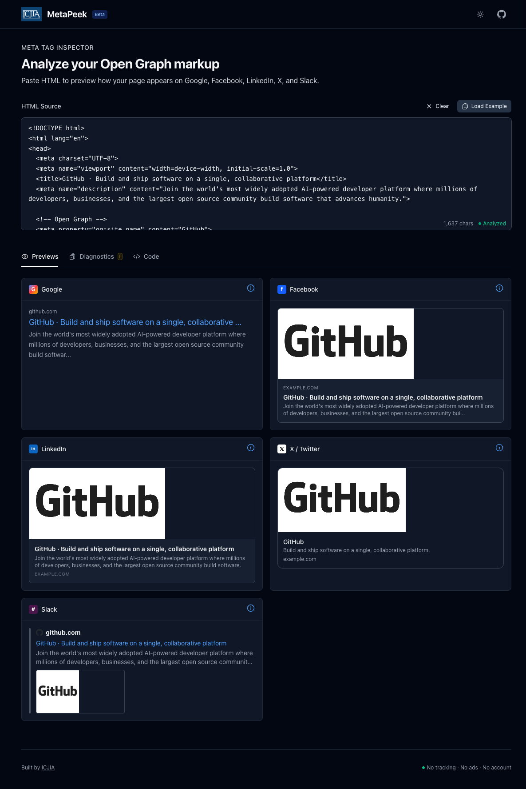
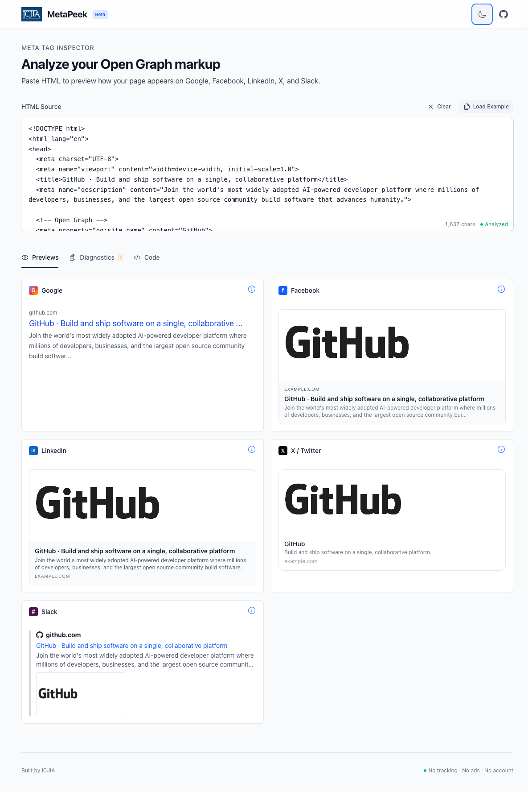

# MetaPeek

> A fast, clean, single-purpose web tool for inspecting, previewing, and generating HTML meta tags and Open Graph markup.

**🔗 Live Demo: [https://metapeek.icjia.app](https://metapeek.icjia.app)**

[](https://nuxt.com/)
[](https://ui.nuxt.com/)
[](https://vuejs.org/)
[](https://www.typescriptlang.org/)
[](https://www.w3.org/WAI/WCAG21/quickref/)

---

## Screenshots

### Dark Mode


### Light Mode


---

## What is MetaPeek?

MetaPeek accepts either a live URL or pasted HTML, extracts all relevant meta tags, Open Graph markup, Twitter Cards, and structured data, then:

- **Renders platform-specific previews** — See how your page appears on Google, Facebook, LinkedIn, X (Twitter), and Slack
- **Diagnoses problems** — Get actionable warnings about missing, malformed, or suboptimal tags
- **Generates corrected markup** — Copy ready-to-use HTML snippets with sensible defaults

### Why MetaPeek?

Current alternatives are either:
- Ad-bloated and slow
- Paywalled after a few uses
- Single-platform (only Facebook or only Twitter)
- Preview-only without actionable fixes
- Silently fail on client-rendered SPAs

MetaPeek is opinionated about being **fast, clean, and actionable**.

---

## Features

### Phase 1 — Client-Side MVP ✅
- [x] Paste HTML and parse instantly (< 100ms)
- [x] Extract all meta tags, Open Graph, Twitter Cards, JSON-LD
- [x] Render accurate platform previews (Google, Facebook, LinkedIn, X/Twitter, Slack)
- [x] Diagnostics panel with color-coded status
- [x] Code generator with editable output
- [x] WCAG 2.1 AA compliant from day one

### Phase 2 — Live URL Fetching 🚧
- [ ] Enter URL and fetch HTML automatically
- [ ] Netlify serverless function proxy
- [ ] SSRF protection and security validation
- [ ] Rate limiting (30 requests/IP/minute)
- [ ] SPA detection with scoring system
- [ ] Redirect chain tracking
- [ ] Shareable URLs (manual fetch, no auto-trigger)

### Phase 3 — Polish & Power Features 📋
- [ ] OG image analysis with crop overlays
- [ ] Structured data viewer with schema.org validation
- [ ] Diff/compare mode (before/after verification)
- [ ] Export as HTML file or JSON
- [ ] Raw HTML debug view

---

## Tech Stack

### Core Framework
- **[Nuxt 4](https://nuxt.com/)** (v4.3.0) — Full-stack Vue framework with SSR
- **[Vue 3](https://vuejs.org/)** (v3.5.27) — Progressive JavaScript framework
- **[TypeScript](https://www.typescriptlang.org/)** (v5.7) — Type safety throughout
- **[VueUse](https://vueuse.org/)** (v14.2) — Essential Vue Composition Utilities

### UI & Components
- **[Nuxt UI](https://ui.nuxt.com/)** (v4.4.0) — Fully styled component library
- **[Tailwind CSS 4](https://tailwindcss.com/)** — Utility-first CSS (via Nuxt UI)
- **[Heroicons](https://heroicons.com/)** — Beautiful hand-crafted SVG icons

### Server & Deployment
- **[Nitro](https://nitro.unjs.io/)** — Nuxt's server engine for API routes
- **[Netlify](https://www.netlify.com/)** — Serverless functions + edge deployment
- **[ofetch](https://github.com/unjs/ofetch)** — HTTP client for proxy requests

### Parsing & Data
- **[DOMParser](https://developer.mozilla.org/en-US/docs/Web/API/DOMParser)** (native) — Client-side HTML parsing
- **[cheerio](https://cheerio.js.org/)** — Server-side HTML parsing for proxy

### Testing & Quality
- **[Vitest](https://vitest.dev/)** — Modern, fast unit testing
- **[Playwright](https://playwright.dev/)** — E2E and accessibility testing
- **[@axe-core/playwright](https://www.npmjs.com/package/@axe-core/playwright)** — Automated accessibility audits

### Accessibility
- **WCAG 2.1 Level AA** compliance mandatory
- Keyboard navigation for all interactions
- Screen reader tested (NVDA, JAWS, VoiceOver)
- 4.5:1 minimum contrast ratio
- No color-only status indicators

### Custom Components

#### AppTooltip

A custom, accessible tooltip component built from scratch (no external dependencies):

```vue
<AppTooltip text="Helpful information">
  <button>Hover me</button>
</AppTooltip>
```

**Features:**
- **Teleport to body** — Escapes parent `overflow: hidden` containers
- **Fixed positioning** — Calculates position based on viewport space
- **Auto-positioning** — Prefers left/right on desktop, top/bottom on mobile
- **Keyboard accessible** — Shows on focus (Tab key)
- **Screen reader compatible** — Uses `role="tooltip"` and `aria-describedby`
- **Instant display** — No delay (configurable via `delay` prop)
- **Smooth animations** — Fade/scale transitions

**Props:**
| Prop | Type | Default | Description |
|------|------|---------|-------------|
| `text` | `string` | required | Tooltip content |
| `position` | `'auto' \| 'top' \| 'bottom' \| 'left' \| 'right'` | `'auto'` | Preferred position |
| `delay` | `number` | `0` | Delay before showing (ms) |

---

## Project Structure

```
icjia-metapeek/
├── app/
│   ├── assets/
│   │   └── css/
│   │       └── main.css     # Tailwind CSS entry point
│   ├── components/          # Vue components
│   │   ├── AppTooltip.vue       # Custom accessible tooltip
│   │   ├── PreviewGoogle.vue
│   │   ├── PreviewFacebook.vue
│   │   ├── PreviewLinkedIn.vue
│   │   ├── PreviewTwitter.vue
│   │   ├── PreviewSlack.vue
│   │   ├── DiagnosticsPanel.vue
│   │   └── CodeGenerator.vue
│   ├── composables/         # Reusable composition functions
│   │   ├── useMetaParser.ts
│   │   ├── useDiagnostics.ts
│   │   ├── useFetchProxy.ts (Phase 2)
│   │   ├── useFetchStatus.ts (Phase 2)
│   │   └── useSpaDetection.ts (Phase 2)
│   ├── pages/
│   │   └── index.vue        # Single-page application
│   ├── types/
│   │   └── meta.ts          # TypeScript type definitions
│   └── utils/
│       ├── constants.ts
│       └── tagDefaults.ts
├── server/
│   ├── api/
│   │   └── fetch.post.ts    # Proxy endpoint (Phase 2)
│   └── utils/
│       └── proxy.ts         # Security utilities (Phase 2)
├── documentation/           # Complete design & implementation docs
│   ├── README.md
│   ├── metapeek-design-doc-final.md
│   ├── pre-launch-checklist.md
│   ├── testing-strategy.md
│   ├── accessibility-guidelines.md
│   ├── phase-1-implementation-guide.md
│   └── initial-package-json.md
├── tests/                   # Test suites
│   ├── unit/                # Vitest unit tests
│   │   ├── useMetaParser.test.ts
│   │   ├── useDiagnostics.test.ts
│   │   └── tagDefaults.test.ts
│   └── e2e/                 # Playwright E2E tests
│       └── accessibility.spec.ts
├── metapeek.config.ts       # Central configuration (single source of truth)
├── nuxt.config.ts           # Nuxt configuration
├── package.json
├── tsconfig.json
└── netlify.toml             # Netlify deployment config
```

---

## Getting Started

### Prerequisites

- Node.js 22.x (use `nvm` with included `.nvmrc`)
- Yarn 1.22.x

### Installation

```bash
# Clone repository
git clone https://github.com/ICJIA/icjia-metapeek.git
cd icjia-metapeek

# Use correct Node version (if using nvm)
nvm use

# Install dependencies
yarn install

# Start development server
yarn dev
```

The app will be available at `http://localhost:3000`

### Available Scripts

```bash
# Development
yarn dev             # Start development server
yarn build           # Build for production
yarn generate        # Generate static site
yarn preview         # Preview production build

# Testing
yarn test            # Run unit tests (verbose output)
yarn test:all        # Run ALL tests (unit + accessibility)
yarn test:unit       # Run unit tests only
yarn test:watch      # Run tests in watch mode
yarn test:coverage   # Generate coverage report
yarn test:accessibility  # Run Playwright accessibility tests

# Type Checking
yarn typecheck       # Check TypeScript types
```

### Test Output

Running `yarn test:all` produces verbose output showing each test:

**Unit Tests (88 tests)** — Vitest with verbose reporter
```
✓ tagDefaults > generateDefaultTags > title generation > uses og:title when available
✓ useDiagnostics > title diagnostics > returns red status when title is missing
✓ useMetaParser > parseMetaTags > extracts og:title
...
```

**Accessibility Tests (5 tests)** — Playwright with axe-core
```
→ Navigating to homepage...
→ Page loaded, running axe-core scan...
→ Scanned 24 passing rules
→ Found 0 violations
✓ No accessibility violations detected
✓ 1 [chromium] › Accessibility Audit - WCAG 2.1 AA Compliance › Initial page load
```

The accessibility tests verify:
- **WCAG 2.1 AA compliance** across all page states (initial load, analyzed content, edit mode)
- **Keyboard navigation** including skip links and tab order
- **Focus management** for all interactive elements

---

## Troubleshooting

### Native Binding Errors (oxc-parser, lightningcss, rollup)

**Problem:** When running `yarn dev` or `yarn install`, you may see errors like:

```
Cannot find native binding. npm has a bug related to optional dependencies
Error: Cannot find module '@oxc-parser/binding-darwin-arm64'
Error: Cannot find module '../lightningcss.darwin-arm64.node'
Error: Cannot find module '@rollup/rollup-darwin-arm64'
```

**Cause:** This typically happens when:
1. A `.yarnrc` file contains `--ignore-optional true`, which prevents native bindings from being installed
2. The `node_modules` folder was installed with a different Node.js version or package manager

**Solution:**

```bash
# 1. Check for and remove problematic .yarnrc
cat .yarnrc  # If it contains "--ignore-optional true", remove it
rm .yarnrc

# 2. Clean install
rm -rf node_modules yarn.lock .nuxt

# 3. Reinstall (without ignore-optional flag)
yarn install

# 4. Start dev server
yarn dev
```

**Prevention:** Never add `--ignore-optional true` to `.yarnrc` when working with Nuxt 4, as it relies on native bindings for:
- `oxc-parser`, `oxc-transform`, `oxc-minify` (TypeScript/JavaScript parsing)
- `lightningcss` (CSS processing)
- `rollup` (bundling)

### VueUse Functions Not Defined

**Problem:** Error like `useDebounceFn is not defined` when loading the page.

**Solution:** Ensure `@vueuse/nuxt` is installed and added to `nuxt.config.ts`:

```bash
yarn add @vueuse/core @vueuse/nuxt
```

```typescript
// nuxt.config.ts
export default defineNuxtConfig({
  modules: ['@nuxt/ui', '@vueuse/nuxt'],
  // ...
})
```

---

## Development Workflow

### Phase 1 (Current)

1. Read `documentation/metapeek-design-doc-final.md` (sections 1-7)
2. Follow `documentation/phase-1-implementation-guide.md`
3. Reference `documentation/accessibility-guidelines.md` for every component
4. Check off items in `documentation/pre-launch-checklist.md`
5. Run accessibility audit before considering any component complete

### Testing Requirements

- **Unit tests:** 88 tests covering composables and utilities (> 80% coverage)
- **E2E accessibility:** 5 Playwright tests with axe-core (zero WCAG 2.1 AA violations)
- **Lighthouse:** Accessibility score must be 100
- **Manual testing:** Keyboard-only navigation must work
- **Screen reader:** Test with NVDA or VoiceOver

Run `yarn test:all` to execute the complete test suite (93 tests).

### Accessibility Standards

MetaPeek **must** meet WCAG 2.1 Level AA standards:

- All interactive elements keyboard accessible
- Visible focus indicators (2px, high contrast)
- Screen reader announcements for status changes
- 4.5:1 minimum contrast ratio for text
- Color never the sole indicator (use icon + text + color)
- All images have appropriate alt text
- Form inputs have associated labels

See `documentation/accessibility-guidelines.md` for detailed requirements.

---

## Configuration

All non-secret configuration lives in `metapeek.config.ts`:

```typescript
// metapeek.config.ts
const metapeekConfig = {
  site: {
    name: 'MetaPeek',
    url: 'https://metapeek.icjia.app',
  },
  proxy: {
    externalUrl: null,  // Set to DigitalOcean URL to switch proxies
    fetchTimeoutMs: 10_000,
    maxResponseBytes: 1_048_576,
  },
  rateLimit: {
    windowLimit: 30,  // 30 requests per minute per IP
    windowSize: 60,
  },
  // ... more config
}
```

**Environment Variables** (`.env` - secrets only):
- `METAPEEK_API_KEY` — Bearer token for proxy auth (dormant at launch)
- `NODE_ENV` — Set automatically by Netlify

---

## Deployment

### Netlify (Production)

```bash
# Push to git main branch
git push origin main

# Netlify auto-deploys via git integration
# View build logs in Netlify dashboard
```

**Pre-Deploy Checklist:**
- [ ] All tests passing
- [ ] Lighthouse accessibility score 100
- [ ] axe DevTools reports zero violations
- [ ] Keyboard navigation tested
- [ ] Screen reader tested
- [ ] Security tests passing (Phase 2)

**Post-Deploy:**
- Monitor Netlify function invocation count (Phase 2)
- Check for rate limit effectiveness
- Verify CORS headers in production
- Test with real URLs from different geolocations

---

## Security

### SSRF Protection (Phase 2)
- DNS resolution with private IP blocking
- Protocol whitelist (HTTPS only in production)
- URL length limits (2048 chars max)
- Response size limits (1MB max)
- Timeout enforcement (10 seconds)

### Rate Limiting (Phase 2)
- Netlify edge-level rate limiting
- 30 requests per IP per minute (configurable)
- Rate-limited requests don't count as invocations
- Paste-HTML mode always available (no rate limit)

### Input Validation
- Request body validation (reject unexpected fields)
- URL validation before fetch
- HTML sanitization (strip script tags from responses)
- No execution of fetched JavaScript

See `documentation/testing-strategy.md` security section for test cases.

---

## Documentation

Complete documentation is in the `documentation/` folder:

- **[Design Document](documentation/metapeek-design-doc-final.md)** — Complete technical specification
- **[Pre-Launch Checklist](documentation/pre-launch-checklist.md)** — Required items for each phase
- **[Testing Strategy](documentation/testing-strategy.md)** — Unit, integration, and accessibility tests
- **[Accessibility Guidelines](documentation/accessibility-guidelines.md)** — WCAG 2.1 AA implementation
- **[Phase 1 Guide](documentation/phase-1-implementation-guide.md)** — Step-by-step implementation
- **[Initial Dependencies](documentation/initial-package-json.md)** — Locked dependency versions

Start with `documentation/README.md` for the full documentation index.

---

## Contributing

MetaPeek is a single-developer project for ICJIA. For questions or issues:

1. Check documentation first (`documentation/` folder)
2. Review design decisions in `metapeek-design-doc-final.md`
3. Verify against pre-launch checklist
4. Test accessibility requirements

---

## License

[Add license here]

---

## Contact

**Illinois Criminal Justice Information Authority**  
Website: [https://icjia.illinois.gov](https://icjia.illinois.gov)  
MetaPeek: [https://metapeek.icjia.app](https://metapeek.icjia.app)

---

## Acknowledgments

Built with modern web standards and accessibility as core principles.

**Key Technologies:**
- Nuxt team for the excellent full-stack framework
- Nuxt UI for accessible, beautiful components
- The accessibility community for WCAG guidelines
- Everyone who builds tools that help developers build better web experiences
